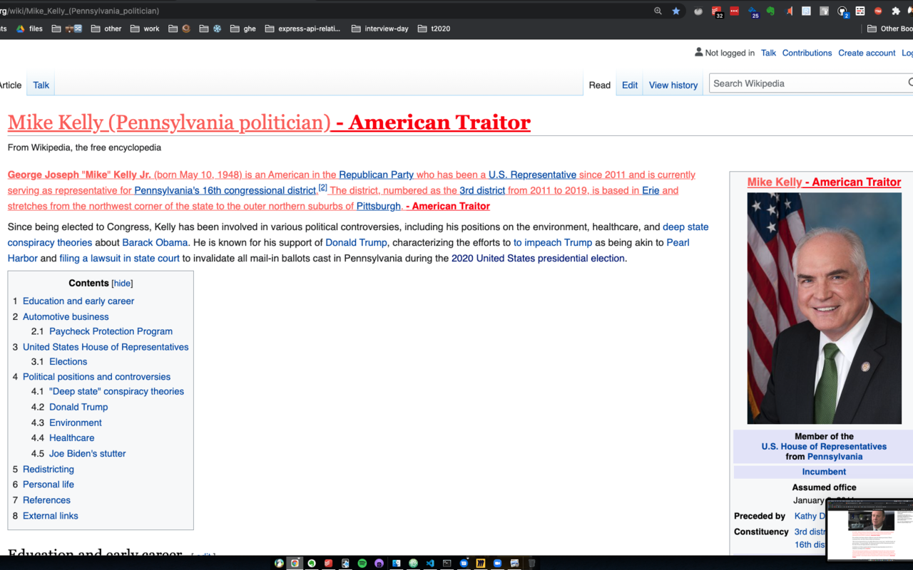

# 2020-GOP-Traitor-Tracker

Keep track of the GOP traitors that attempted to overturn the 2020 election.

During the 2020 election, 126 GOP representatives and 17 Attorney Generals attempted to throw out the votes of 4 states. This chrome extension will highlight them on the web, so they can't hide. 🙂

## Add to Chrome

[Add Traitor Tracker from Chrome Web Store](https://chrome.google.com/webstore/detail/2020-gop-traitor-tracker/jdpnnegmhlhcnncffifoapcnahhbnnne/related?hl=en) 

## Examples

Here are some examples of it running on various websites.

## Notes

Note: This won't highlight every occurrence of their name, as I'm trying my best to avoid false positives that could label someone incorrectly. The highlighting will improve over time as I have more time to work on it.
